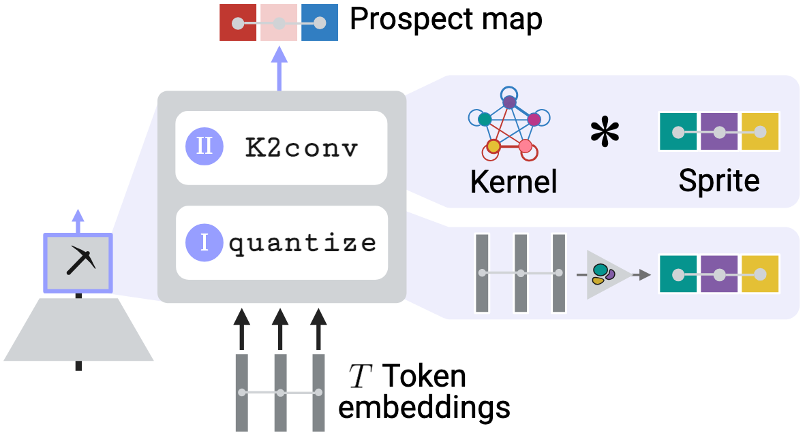

# Prospector Heads

## Important links:  
- [arxiv](coming soon!)
- [xeets](coming soon!)   
- [blog](coming soon!)

## Introduction
Welcome to the Prospector Heads repo! Here, we share our implementation of prospector heads (aka "prospectors"). This repo is nicknamed "K2" for readability and legacy purposes, and references a key operator in prospector module called \***k2conv**\* (see our arXiv paper above!). As a work in progress, this repo will continue to get weekly updates (see bottom of this readme).  

At a high level, prospectors offer feature attribution capabilties to virtually any encoder while being:
- Computationally efficient (sub-quadratic)
- Data-efficient (through parameter efficiency)
- Performant at feature localization
- Modality-generalizable
- Interpretable... and more!

## High-level usage
The core functionality of prospectors follows a similar API to `scikit-learn` package. As detailed in our arXiv preprint, prospectors contain two trainable layers, which we train sequentially in this implementation. Prospectors can be used with 3 simple steps:

1. Convert data to `networkx` graph objects, where each graph node is loaded with a token embedding (e.g. see `Doc-Step1-Embed.ipynb` for text encoders). Note: connectivity and resolution is defined by the user.
2. Construct a `K2Processor` object and then fit layer (I)'s quantizer via `.fit_quantizer()` command (e.g. see `Histo-Step2-VizSetup.ipynb`). Note: this can assume a random sample of token embeddings
3. Construct a `K2Model` object and then fit layer (II)'s convolutional kernel via the `.create_train_array()` and `.fit_kernel()` commands (e.g. see `Doc-Step2-VizSetup.ipynb`)

The IPython notebooks herein also give examples on how to visualize:
- Data sprites (false color representations of data colored by concepts)
- Concept monogram and skip-bigram frequencies (per datum) as fully connected graphs
- Prospector convolutional kernels as fully connected graphs
- Prospect maps as outputs for feature attribution

## Repo roadmap
We present IPython notebooks for each experimented modality. The following naming convention is used for notebooks:
- Any notebook beginning with "Doc" outlines experiments for sentence retrieval in text documents (sequences)
- Any notebook beginning with "Histo" outlines experiments for tumor localization in histopathology slides (images)
- Any notebook beginning with "Protein" outlines experiments for binding site identification in protein strucutures (graphs)

Python files contain all architectures and helper functions used in the notebooks. Here we briefly summarize each file (*bolding* any modality-specific files):
- `architectures.py`: encoder architectures used for *pathology/imagery*
- `attention-baselines.py`: attention-based heads used as baselines for *proteins/graphs*
- `eval-baselines.py`: evaluation of baselines for *proteins/graphs*
- `evaluation.py`: all evaluation functions: training gridsearch, model selection, test-set evaluation, target region characteristics (e.g. prevalence, dispersion)
- `job_params.py`: example function for loading in hyperparameters outside of a notebook - especially useful for bash scripting
- `k2.py`: *The prospector head architecture*
- `metrics.py`: metrics used for training grid search / model selection
- `model_selection.py`: helper functions for model selection
- `process_protein_data.py`: helper functions for processing *protein/graph* data
- `protein-eval.py`: evaluation script for *protein/graph* data
- `run_gridsearch.py`: script to run training grid search -- especially useful for bash scripting
- `utils.py`: all highly-used helper functions for prospector heads, including visualizations; interfaces heavily with `k2.py`
- `xml_parse.py`: data preprocessing for *protein/graph* data

## Dependencies
Prospectors' dependecies are very light, only requiring the following popular/maintained packages:
- `os`
- `numpy`
- `pandas`
- `networkx`
- `scikit-learn`
- `pickle`
- `dill`

This work was originally implemented in Python 3.10. Given light dependencies, we anticipate fairly seemless support for future Python versions. 

## Future development
We plan to make a more official repo release in the coming weeks and months. At this time, our priority is to get this software into the hands of researchers applying feature attribution to large data with large models. Looking forward, we anticipate the following quality of life improvements:

- [ ] Updated OOP nomenclature — ideally standardized with our arXiv preprint
- [ ] Pytorch support for individual layer fitting (e.g. torch-enabled k-means as a quantizer)